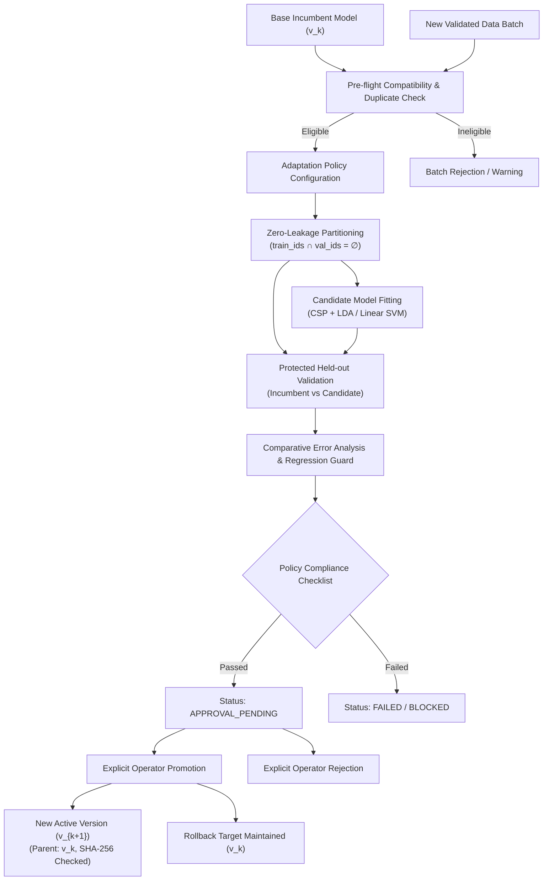

# NeuroMove Architecture — Adaptive Learning & Controlled Model Update Pipeline

## 1. System Overview & Objective
Phase 14 establishes a research-grade, gated, auditable, reversible, and versioned adaptive-learning architecture for NeuroMove.
Rather than allowing unconstrained online weights updates—which risk catastrophic forgetting, silent performance degradation, or data leakage—NeuroMove implements a controlled batch adaptation lifecycle:

$$\text{Base Model } (v_k) \xrightarrow{+ \text{New Validated Trials}} \text{Compatibility Gate} \xrightarrow{\text{Adaptation Policy}} \text{Candidate Model } (v_{k+1}) \xrightarrow{\text{Protected Validation}} \text{Regression Guard} \xrightarrow{\text{Operator Promotion}} \text{Active Version}$$

---

## 2. Core Invariants & Rules

### Rule 1 — No Silent Model Updates
Data arrival never triggers automatic model updates. Data ingestion produces a candidate model (`candidate_model_id`) in a non-active `CANDIDATE` lifecycle state.
$$\text{Data Ingested} \neq \text{Model Updated} \neq \text{Model Promoted}$$

### Rule 2 — Zero Data Leakage Invariant
All training data partitions and protected validation data partitions remain strictly disjoint:
$$\mathcal{D}_{\text{train}} \cap \mathcal{D}_{\text{val}} = \emptyset$$
Duplicate epoch identifiers and signal hashes between historical base data and new candidate data batches are automatically detected and pruned before partitioning.

### Rule 3 — Explicit Operator Promotion & Rejection
A candidate model transitions to `ACTIVE_RESEARCH` status only when:
1. All deterministic policy criteria are satisfied (minimum samples, class balance, minimum balanced accuracy, allowable regression limit).
2. An operator explicitly submits an approval action logged with audit notes and timestamp.

### Rule 4 — Reversibility & Rollback
Every promoted version retains immutable parent links (`parent_model_id`). Operators can roll back the active pointer to any prior validated version ($v1 \leftarrow v2 \leftarrow v3$) instantly without deleting version lineage.

### Rule 5 — Strict Research Boundary
Adaptation metrics, candidate models, and distribution drift diagnostics exist strictly in the research offline/replay environment. They are **NEVER** coupled to real-time `SafetyDecision`, `RobotCommand`, ESP32 firmware, or physical mobility actuators.
