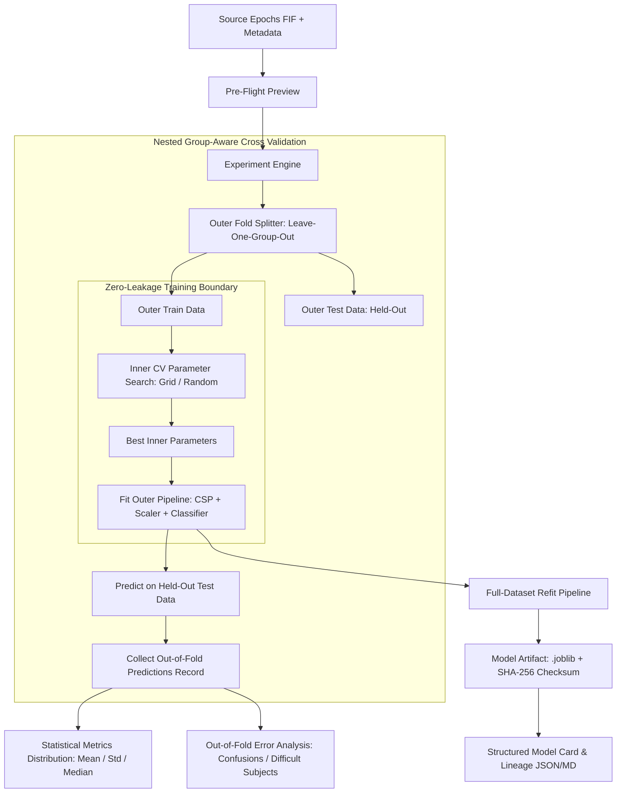

# Phase 12 Architecture: AI Model Laboratory & Rigorous Evaluation

## 1. Overview & Research Philosophy

The **NeuroMove AI Model Laboratory** expands the supervised motor-imagery decoding foundations established in Phase 11 into a scientific experiment platform. The design goal is not to maximize a single cherry-picked accuracy figure, but to provide a reproducible, leakage-free environment where every model prediction, cross-validation split, and artifact can answer:

- **What Dataset?** (`dataset_id`, source recording manifests)
- **What Subjects & Runs?** (Stratified or Leave-One-Subject-Out group partitioning)
- **What Preprocessing?** (Filter passbands, notch filtering, referencing, ICA)
- **What Epoch Representation?** (Motor imagery events, time windows, baseline correction)
- **What Feature Representation?** (Common Spatial Patterns log power, band power, spatial covariance)
- **What Model Family & Hyperparameters?** (LDA, Linear SVM, Kernel SVM, Logistic Regression, Random Forest, Dummy Baseline)
- **What Evaluation Protocol?** (Nested Cross-Validation with inner search isolated inside training partitions)
- **What Artifact & Environment?** (SHA-256 joblib payload, exact Python/scikit-learn/MNE dependencies)

---

## 2. System Architecture

---

## 3. Supported Model Families & Search Spaces

| Model Family | Scikit-Learn Estimator | Default Tunable Hyperparameters | Search Support |
| :--- | :--- | :--- | :--- |
| `DUMMY` | `DummyClassifier` | `strategy: ["prior", "uniform"]` | Grid / Random |
| `LDA` | `LinearDiscriminantAnalysis` | `solver: ["svd", "lsqr"]`, `shrinkage` | Grid / Random |
| `SVM_LINEAR` | `SVC(kernel="linear")` | `C: [0.01, 0.1, 1.0, 10.0]` | Grid / Random |
| `SVM_RBF` | `SVC(kernel="rbf")` | `C: [0.1, 1.0, 10.0]`, `gamma: ["scale", "auto"]` | Grid / Random |
| `LOGISTIC_REGRESSION` | `LogisticRegression` | `C: [0.01, 0.1, 1.0, 10.0]` | Grid / Random |
| `RANDOM_FOREST` | `RandomForestClassifier` | `n_estimators: [25, 50, 100]`, `max_depth: [3, 5, 8]` | Grid / Random |

---

## 4. Safety & Actuator Isolation Invariant

> [!IMPORTANT]
> All AI models, classification pipelines, and predictions produced in Phase 12 operate strictly in **OFFLINE_RESEARCH** or **REPLAY** mode.
> Under no circumstances are model outputs directly connected to physical actuators, wheel motors, or the ESP32 safety state machine without passing through the multi-stage arbitration, confidence gating, and emergency stop overrides.
