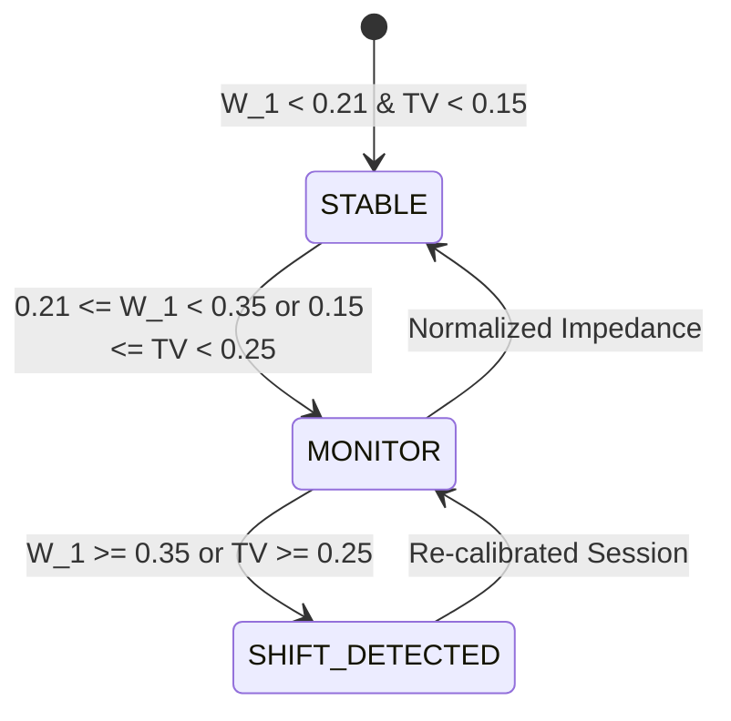

# NeuroMove Architecture — Research Distribution Shift & Drift Diagnostics

## 1. Objective & Non-Clinical Scope
Electrophysiological signals recorded over longitudinal sessions exhibit statistical distribution shifts due to scalp-electrode impedance fluctuations, sensory habituation, non-task background oscillations, and slight montage adjustments.

NeuroMove implements research diagnostic monitoring for these distribution shifts without triggering autonomous model modifications.

> [!NOTE]
> **Scientific Terminology Invariant**: Distribution shift metrics are designated strictly as *"feature distribution shift"*, *"class distribution change"*, or *"signal quality variation"*. They are never labeled as "brain drift", "neural degradation", or "clinical decline".

---

## 2. Statistical Diagnostic Metrics

### A. Feature Distribution Shift (Standardized Wasserstein Distance)
For each feature dimension $d \in \{1, \dots, D\}$ extracted by the baseline CSP filters:
$$W_1(P_d, Q_d) = \int_{-\infty}^{\infty} |F_{P_d}(x) - F_{Q_d}(x)| \, dx$$
where $P_d$ is the standardized baseline distribution and $Q_d$ is the recent window distribution.
The composite score is the mean 1D Wasserstein distance across all components:
$$\text{Score}_{\text{feature}} = \frac{1}{D} \sum_{d=1}^D W_1(\tilde{P}_d, \tilde{Q}_d)$$

### B. Class Distribution Shift (Total Variation Distance)
Measures label distribution asymmetry between baseline and recent session windows:
$$\delta(p, q) = \frac{1}{2} \sum_{c \in \mathcal{C}} |p_c - q_c| \in [0, 1]$$

### C. Electrode Signal Quality Index
Computes peak-to-peak amplitude stability ($V_{\text{pp}} \in [10, 100]\,\mu\text{V}$), signal-to-noise ratio (SNR), and artifact rejection ratio.

---

## 3. Diagnostic States

- `STABLE`: Feature distributions and label balance match baseline expectation.
- `MONITOR`: Marginal shift detected; flagged for operator observation.
- `SHIFT_DETECTED`: Significant statistical shift observed; operator is prompted to review calibration protocol or run a candidate adaptation experiment.
- `INSUFFICIENT_DATA`: Window has fewer than 4 trials.
