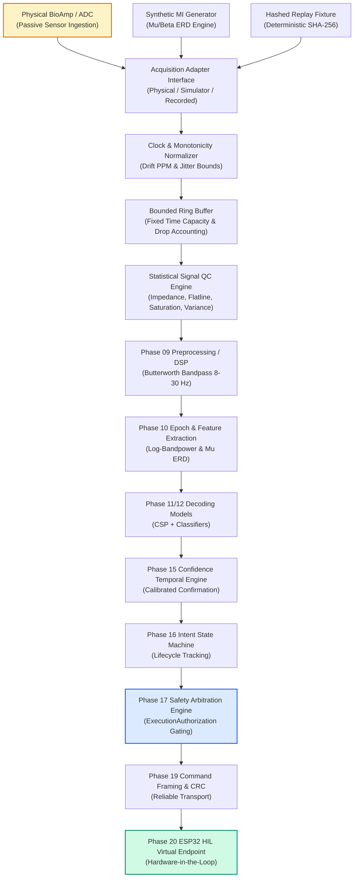

# Real EEG / BioAmp Acquisition Subsystem Architecture

## 1. Executive Summary & Objective

Phase 21 introduces the **Real EEG / BioAmp Acquisition & Ingestion Subsystem** to NeuroMove. This subsystem bridges physical EEG sensors (BioAmp EXG, OpenBCI Cyton/Ganglion, LSL streams, serial ADCs), deterministic motor-imagery signal generators, and byte-for-byte SHA-256 verified recorded replay fixtures into the end-to-end neurophysiology, safety arbitration, and hardware simulation pipeline.

## 2. Inviolable Safety Invariants

1. **Non-Actuation Invariant**: Physical EEG acquisition is strictly an inbound passive telemetry source. Under zero circumstances are physical motors, PWM drivers, or wheelchair actuators energized.
2. **Authoritative Downstream Endpoint**: All physical EEG data routes exclusively to the Phase 20 ESP32 HIL / virtual serial endpoint.
3. **Pre-flight Authorization Invariant**: No command frame is transmitted across the transport layer unless a valid `ExecutionAuthorization` is issued by the Phase 17 Safety Arbitration Engine. Any `DENIED`, `HELD`, `INVALID`, or uncalibrated state yields `will_transmit=False` and 0 serial frames transmitted.
4. **Honest Hardware Availability**: The physical adapter (`PhysicalEegAcquisitionAdapter`) performs safe non-blocking port probing and honestly reports `is_available: False` when hardware is disconnected. It never fakes physical connection in CI or development.
5. **Deterministic Replay Guarantee**: Recorded replay fixtures use verifiable SHA-256 hashes and monotonic sample indices to guarantee byte-for-byte reproducible offline debugging.
