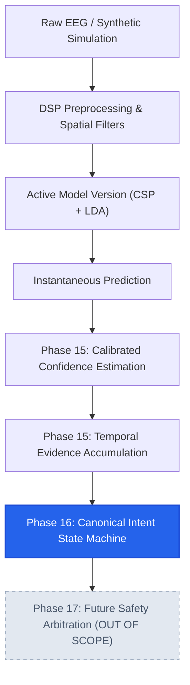
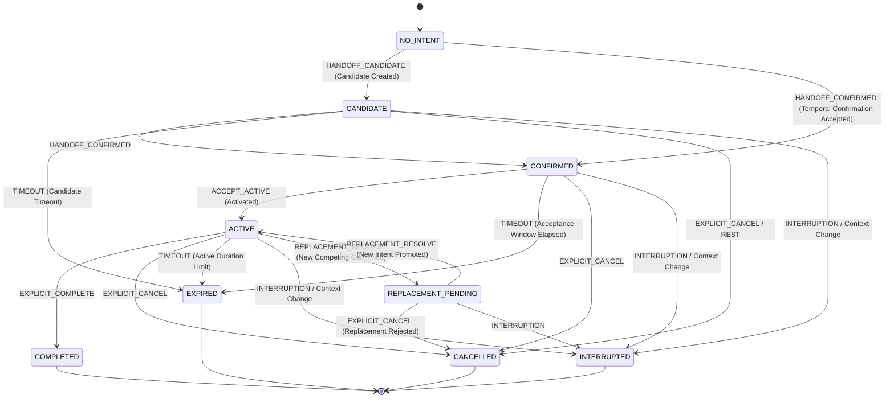

# Canonical Intent State Machine Architecture

## 1. Overview & Architectural Boundaries

The **Canonical Intent State Machine** (`Phase 16`) is the authoritative subsystem governing the semantics, lifecycle progression, and auditable history of decoded motor-imagery intents in NeuroMove.

It operates strictly between Phase 15 (Confidence Estimation & Temporal Confirmation) and Phase 17 (Safety Arbitration):

### Critical Scope Boundaries
- **Phase 15 validates**: *"Is there sufficiently calibrated and temporally sustained electrophysiological evidence for candidate intent $X$?"*
- **Phase 16 authoritatively decides**: *"Given that evidence, what canonical intent state does the system occupy, how did it arrive here, and what is allowed next?"*
- **Phase 17 will evaluate**: *"Is the authoritative active intent state admissible under safety, obstacle, and speed envelope rules?"*
- **Absolute Rule**: Phase 16 **NEVER** issues robot/actuator commands, transmits ESP32 motor signals, or marks an intent as "safety approved".

---

## 2. Canonical Finite State Machine Diagram

---

## 3. Core State Machine Invariants

1. **Invariant A (Single Authoritative Active Intent)**:
   At most one intent may be in the `ACTIVE` or `REPLACEMENT_PENDING` state for a given subject and session context.
2. **Invariant B (No Impossible Transitions)**:
   All transitions must follow the explicit transition matrix. Direct jumps like `NO_INTENT` $\to$ `COMPLETED` or `NO_INTENT` $\to$ `CANCELLED` are rejected.
3. **Invariant C (Terminal Immutability)**:
   The terminal states (`COMPLETED`, `CANCELLED`, `EXPIRED`, `INTERRUPTED`) cannot mutate in place. Any subsequent intent requires a fresh `intent_id`.
4. **Invariant D (Identity Stability)**:
   The `intent_id` remains stable and immutable throughout its lifecycle from candidate/confirmed to terminal.
5. **Invariant E (Subject / Session Context Isolation)**:
   An intent cannot cross subject or session boundaries. Any change in `subject_id` or `session_id` immediately interrupts active lifecycles.
6. **Invariant F (Model Version Lineage Provenance)**:
   Every intent retains the `model_version_id` that generated the originating prediction. If the active model version updates, prior active intents are cleanly interrupted.
7. **Invariant G (Confidence Provenance)**:
   Transitions retain upstream Phase 15 evidence references (`confidence_score`, `confidence_band`, `source_event_id`).
8. **Invariant H (No Safety / Actuator Coupling)**:
   No code in the intent lifecycle module triggers physical movement, robot packets, or bypasses safety arbitration.
