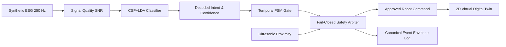

# Live Command Center — Flagship Real-Time Control Experience

## 1. Architectural Mission
The **Live Command Center** (`/live`) serves as the primary operational environment for the NeuroMove neuro-robotics mobility platform. It integrates:
- Deterministic simulation engine (Phase 03)
- Canonical domain contracts and event envelopes (Phase 02)
- High-frequency WebSocket streaming and backpressure transport (Phase 04)
- Light-first design system 2.0 with WCAG 2.1 AA accessibility (Phase 05)

---

## 2. Four-Tier Information Hierarchy

| Level | Component Focus | Key Metrics / Elements |
| :--- | :--- | :--- |
| **Level 1** | Core State & Decisions | Neural Intent, Bayesian Confidence, Safety Arbitration Decision (`APPROVED`, `BLOCKED`, `STOP`), Finite-State Machine state |
| **Level 2** | Perception & Electrophysiology | Multi-channel EEG SNR (C3, Cz, C4), 3-sector proximity radar (FRONT, LEFT, RIGHT cm), Transport diagnostics |
| **Level 3** | Virtual Robot & Simulation | Differential drive odometry, heading orientation, motor PWM, simulation toolbar & scenario selector |
| **Level 4** | Audit History & Logs | Chronological canonical event stream with expandable payload inspector and category filters |

---

## 3. Authoritative Backend State
The React frontend functions strictly as an operational display and supervisory interface:
- **No Client-Side Safety Arbitration**: Obstacle avoidance and emergency stops are evaluated and enforced exclusively by the core Python engine.
- **Explicit Source Attribution**: Simulated telemetry is always marked as `SIMULATION`, `SYNTHETIC EEG`, `VIRTUAL ROBOT`, and `SIMULATED PROXIMITY`.
- **Fault Handling**: Hardware disconnections (`EEG_DISCONNECT`, `ROBOT_DISCONNECT`) trigger immediate visual state degradation and safe holds without crashing the UI.
