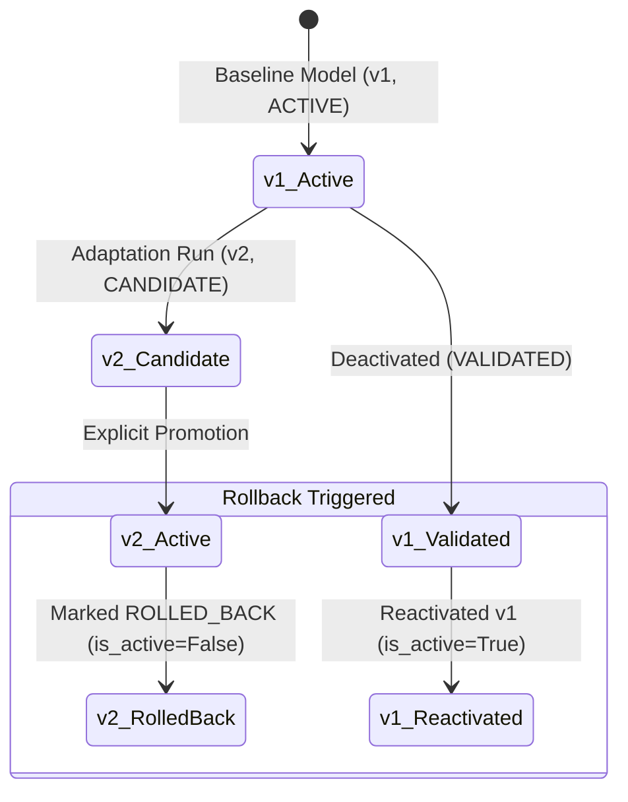

# NeuroMove Architecture — Model Rollback & Reversibility Protocol

## 1. Rollback Mechanism
Every model version created within NeuroMove is immutable and retained in database lineage. If an operator discovers performance inconsistencies in offline replay or domain changes after a candidate has been promoted, the system provides instantaneous rollback to any prior validated version ($v1 \leftarrow v2 \leftarrow v3$).

---

## 2. Reversibility Invariants
1. **History Preservation**: Rolling back never deletes model weights (`.joblib`), metadata, metrics, or validation manifests.
2. **Audit Logging**: Every rollback operation generates an immutable `RollbackEvent` record storing:
   - `from_model_id`: The model version being deactivated.
   - `to_model_id`: The target model version being reactivated.
   - `reason`: Operator-provided explanation.
   - `operator_action`: `"MANUAL_ROLLBACK"`.
   - `timestamp`: UTC ISO timestamp.
3. **Target Eligibility**: Rollback can only target previously `VALIDATED` or `ACTIVE_RESEARCH` versions. Models marked `REJECTED` or `INVALID` are ineligible for reactivation.
