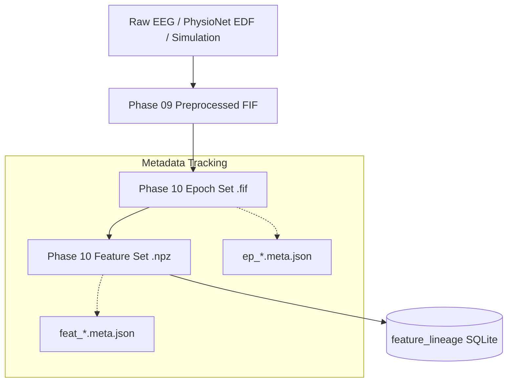

# Research Leakage Prevention & Traceability Architecture

## Overview

Data leakage in BCI research leads to falsely inflated classification accuracy and decoders that fail in cross-subject or real-time deployment. Common leakage vectors include:
1. Slicing trials across recording/run boundaries.
2. Mixing trials from the same subject into both training and testing folds without explicit subject tracking.
3. Estimating normalization parameters (such as global mean/standard deviation) across the entire dataset prior to cross-validation partitioning.
4. Loss of provenance linking extracted features back to raw source files and specific filter settings.

NeuroMove implements structural safeguards to guarantee research reproducibility and prevent data leakage.

## Lineage Graph & Content Addressing

Every epoch and feature vector in NeuroMove is embedded in a complete acyclic lineage graph:

## Mandatory Grouping Identifiers

Every row in the feature matrix ($X_i$) is irrevocably bound to:
- `subject_id`: Identifier of the human subject (e.g. `subject_001` or `subject_simulation`).
- `session_id`: Recording session / day (e.g. `session_01`).
- `run_id`: Experimental run (e.g. `R04`).
- `recording_id`: Original source recording file.
- `trial_id`: Sequential trial index within the recording.
- `event_id`: Normalized event code and source timing.

## Invariant Guarantees for Future Machine Learning

1. **Leave-One-Subject-Out (LOSO) Ready**: Cross-validation splitting algorithms can group strictly by `subject_id` without risking intra-subject temporal leakage.
2. **Deterministic Hashing**: If input parameters, mapping rules, or source data change, a new content hash is generated; previous artifacts remain immutable.
3. **No In-Place Modification**: Preprocessed FIF and Raw EDF files are opened in read-only mode and are never modified in place.
