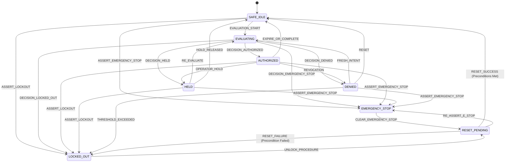

# Safety State Machine, Precedence Hierarchy & Recovery Lifecycle

## 1. Canonical State Definitions

The Safety Arbitration State Machine operates across 8 deterministic finite states:

---

## 2. Precedence Hierarchy

When multiple safety constraints or violations occur simultaneously, the arbiter evaluates rules against an explicit, immutable precedence hierarchy:

| Rank | Category | Canonical Decision | Target State | Description |
| :---: | :--- | :--- | :--- | :--- |
| **1** | `EMERGENCY_STOP` | `EMERGENCY_STOP` | `EMERGENCY_STOP` | Software E-stop dominates all other conditions. |
| **2** | `LOCKED_OUT` | `LOCKED_OUT` | `LOCKED_OUT` | Threshold violation lockout blocks all operations. |
| **3** | `MALFORMED_INPUT` | `INVALID` | `DENIED` | Missing or malformed intent payload. |
| **4** | `CRITICAL_HEALTH` | `DENIED` | `DENIED` | Core service degraded or reporting unknown health. |
| **5** | `HARD_CONSTRAINT` | `DENIED` | `DENIED` | Eligibility, blocked class, rate, or duration violation. |
| **6** | `CONTEXT_STALE` | `DENIED` | `DENIED` | Stale timestamps, stream disconnected, or model mismatch. |
| **7** | `OPERATOR_HOLD` | `HELD` | `HELD` | Active manual operator pause. |
| **8** | `TEMPORARY_HOLD` | `HELD` | `HELD` | Transient cooldown or context preparation. |
| **9** | `ALL_GATES_PASS` | `AUTHORIZED` | `AUTHORIZED` | Unanimous pass across all 13 rules. |

---

## 3. Fail-Closed Recovery & Startup Behavior

- **Database-Backed Startup Invariant**:
  If the previous process shutdown or crashed while in `EMERGENCY_STOP` or `LOCKED_OUT`, `SafetyStorage.recover_state_on_startup()` automatically restores the restrictive state upon restart. A server reboot never clears an emergency stop or lockout!
- **Clear Procedure Invariant**:
  Clearing an emergency stop or unlocking a lockout transitions strictly to `RESET_PENDING`. It **never** auto-authorizes. A verified reset sequence is mandatory to reach `SAFE_IDLE`, and a fresh evaluation must run to reach `AUTHORIZED`.
