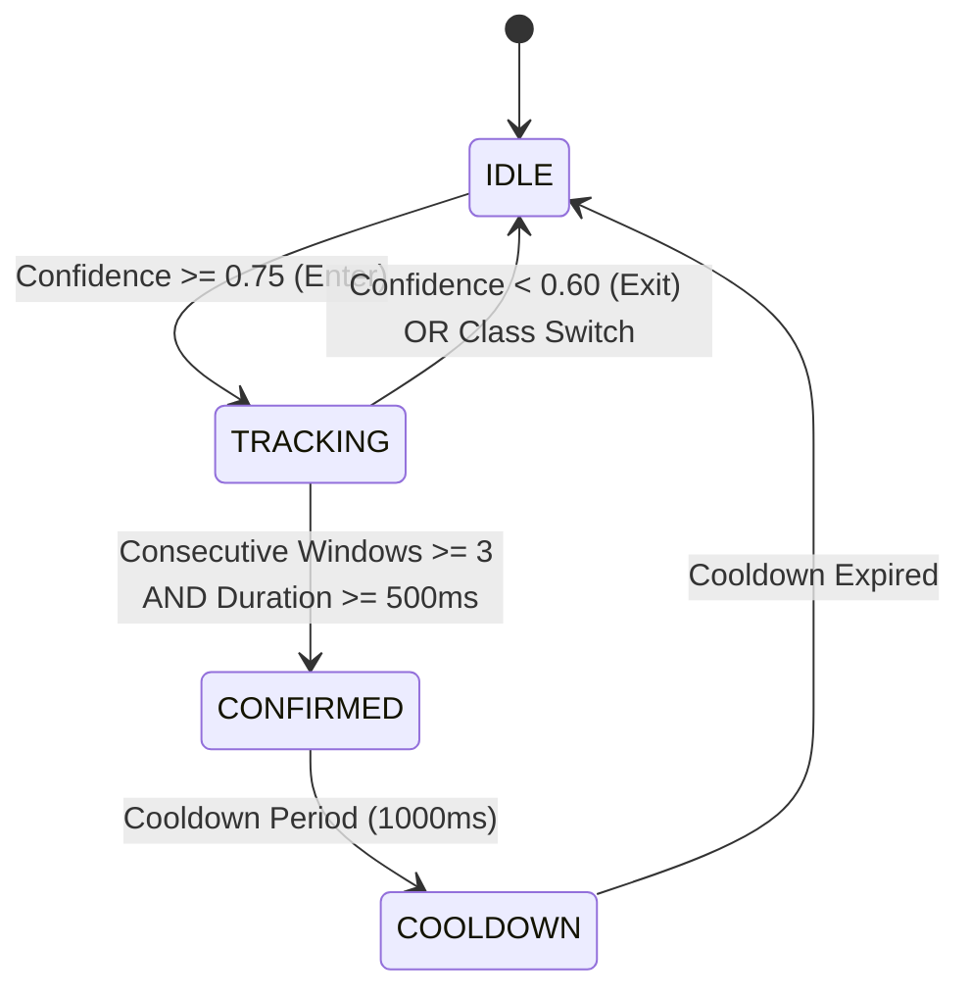

# NeuroMove Architecture: Temporal Confirmation Engine

## 1. Role & Intent State Machine Boundary
Temporal confirmation prevents spurious, instantaneous predictions from propagating downstream. It verifies that predictive evidence is sustained across consecutive electrophysiological windows before handoff:

$$\mathbf{TEMPORAL\ EVIDENCE\ ACCUMULATION} \longrightarrow \mathbf{CONFIRMATION} \longrightarrow \text{Phase 16 Intent State Machine}$$

> [!NOTE]
> Temporal confirmation is **NOT** the final intent state. Phase 15 validates sustained evidence; Phase 16 manages intent transitions, user cancellation, and multi-state arbitration.

---

## 2. Hysteresis Policy
To avoid flapping around decision boundaries, the engine enforces asymmetric entry and exit thresholds:
- **Hysteresis Entry Threshold ($\theta_{\text{enter}}$)**: $0.75$ — required to initiate evidence tracking for a new candidate class.
- **Hysteresis Exit Threshold ($\theta_{\text{exit}}$)**: $0.60$ — confidence must fall below this floor to cancel ongoing candidate accumulation.



---

## 3. Cooldown & Refractory Semantics
- **`cooldown_ms`** ($1000\text{ms}$): Following confirmation, immediate re-confirmations are suppressed unless `allow_same_class_reconfirmation` is explicitly enabled.
- **`refractory_ms`** ($500\text{ms}$): Minimum pause before tracking a new candidate class.

---

## 4. Boundary Reset Semantics
Temporal state is strictly isolated across operational boundaries:
1. **Model Version Transition**: If $m_t \ne m_{t-1}$, temporal evidence resets immediately (`MODEL_CHANGED`).
2. **Subject Switch**: If $s_t \ne s_{t-1}$, temporal evidence resets (`SUBJECT_CHANGED`).
3. **Session Switch**: Session boundaries reset accumulation (`SESSION_CHANGED`).
4. **Stream Timeout**: Gaps exceeding `max_gap_ms` ($250\text{ms}$) trigger a `STREAM_INTERRUPTION` reset.

---

## 5. Phase 16 Handoff Contract
```typescript
interface Phase16IntentHandoffPayload {
  prediction: string;
  confidence: number;
  confidence_band: ConfidenceBand;
  eligibility: ConfidenceEligibility;
  temporal_status: TemporalStatus;
  temporally_confirmed: boolean;
  confirmation_timestamp: number | null;
  confirmation_reason: string;
  model_version_id: string;
  subject_id?: string;
  session_id?: string;
  evidence_window_count: number;
  evidence_duration_ms: number;
}
```
