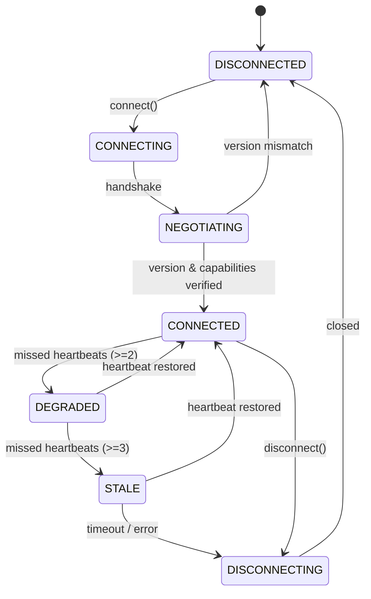

# NeuroMove Architecture: Command Transport & ESP32 Protocol Layer (Phase 19)

## 1. Overview & Context

Phase 19 defines the software communication protocol and command-transport abstraction required for embedded device integration. Operating strictly downstream of Phase 17's Safety Arbitration Gate and Phase 18's Resilience Laboratory, Phase 19 formalizes how an already-authorized software execution request is transformed into a deterministic, validated, sequenced, and acknowledged transport frame.

```
[EEG / Simulation]
        ↓
[DSP / Preprocessing]
        ↓
[Decoding / AI Model]
        ↓
[Phase 15: Confidence & Temporal Confirmation]
        ↓
[Phase 16: Canonical Intent Engine]
        ↓
[Phase 17: Safety Arbitration Gate]
        ↓ (ExecutionAuthorization: AUTHORIZED)
[Phase 18: Resilience Verification Laboratory]
        ↓
[PHASE 19: COMMAND TRANSPORT & ESP32 PROTOCOL]
        ↓
[Hardware-Abstraction Boundary (TransportAdapter)]
        ↓
[Phase 20: Hardware-in-the-Loop Integration]
```

## 2. Core Safety Invariants

1. **Upstream Safety Authorization Invariant**: Phase 19 never re-evaluates, relaxes, or overrides safety decisions. Transport frames for execution commands are generated **only** if an explicit `ExecutionAuthorization` from Phase 17 is verified as current, valid, unexpired, and strictly `SafetyDecision.AUTHORIZED`.
2. **Zero Accidental Transmission**: An upstream decision of `DENIED`, `HELD`, `EMERGENCY_STOP`, `LOCKED_OUT`, or `INVALID` results in `NO_COMMAND`. Zero frames are constructed or transmitted.
3. **Pure Software Scope Boundary**: Phase 19 produces a protocol specification and an in-memory simulated endpoint (`Esp32Simulator`). Zero physical hardware actuation occurs—no GPIO, PWM, motor commands, wheel controllers, serial port flashing, or physical braking.

## 3. Protocol State Machine

The transport link lifecycle is governed by an explicit 7-state finite state machine:



## 4. Phase 20 Hardware Handoff Contract

The interface between the platform core and embedded endpoints is defined by the abstract `TransportAdapter` interface:

```python
class TransportAdapter(abc.ABC):
    @abc.abstractmethod
    def connect(self) -> bool: ...
    @abc.abstractmethod
    def disconnect(self) -> None: ...
    @abc.abstractmethod
    def negotiate(self, client_version: str, session_id: str) -> tuple[bool, str, str]: ...
    @abc.abstractmethod
    def send_frame(self, frame_bytes: bytes) -> CommandAck | CommandNack: ...
    @abc.abstractmethod
    def ping(self) -> float: ...
    @abc.abstractmethod
    def health(self) -> TransportConnectionState: ...
    @abc.abstractmethod
    def capabilities(self) -> list[DeviceCapability]: ...
    @abc.abstractmethod
    def identity(self) -> DeviceIdentity: ...
    @abc.abstractmethod
    def close(self) -> None: ...
```

In Phase 19, `SimulatedEsp32Adapter` implements this boundary entirely in software. In Phase 20, `RealEsp32Adapter` replaces the simulated adapter without requiring any modifications to upstream safety authorization, framing, sequencing, or reliability semantics.
