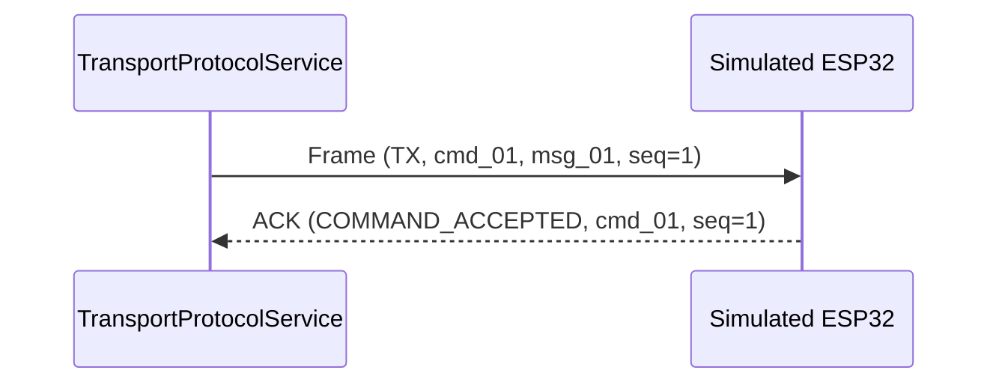

# NeuroMove Architecture: Transport Reliability, Idempotency & Sequencing (Phase 19)

## 1. Monotonic Sequencing

Sequence numbers are scoped per-connection/per-session and increment monotonically from baseline `1` up to `2,147,483,647` (31-bit signed max).

### Sequencing Rules:
- **Exact Match (`seq == expected`)**: Processed normally; expected counter advances to `seq + 1`.
- **Duplicate (`seq < expected` or already in history)**: Acknowledged idempotently with `COMMAND_DUPLICATE` without triggering secondary execution.
- **Sequence Gap (`seq > expected`)**: Rejected with `SEQUENCE_GAP` error; prevents silent loss of intermediate commands.
- **Out-of-Order Regression**: Rejected; prevents backward state transitions.

## 2. Idempotency & Replay Protection

To distinguish between a new logical command and a retransmission of an existing command:
- **`command_id`**: Identifies the logical execution lifecycle. It remains identical across all retries.
- **`message_id`**: Identifies the specific network frame transmission. A new `message_id` and sequence number are generated for each attempt.

When an embedded endpoint receives a frame:
1. It queries its duplicate table for `command_id`.
2. If found, it immediately responds with `COMMAND_DUPLICATE` without re-executing the intent.

## 3. Acknowledgement & Retry Policy

### Bounded Exponential Backoff:
- Maximum attempts: `3`
- Initial delay: `100ms`
- Multiplier: `2.0`
- Maximum delay: `2000ms`

### Retry Classification:
- **Retryable**: `TIMEOUT`, `CONNECTION_RESET`, `ENDPOINT_TEMPORARILY_BUSY`, `TRANSPORT_DROP`.
- **Non-Retryable**: `AUTHORIZATION_EXPIRED`, `AUTHORIZATION_DENIED`, `CHECKSUM_MISMATCH`, `SESSION_MISMATCH`, `SUBJECT_MISMATCH`, `PROTOCOL_VERSION_MISMATCH`, `CAPABILITY_UNSUPPORTED`.
Non-retryable errors immediately terminate the command lifecycle as `REJECTED` or `FAILED`.

## 4. Heartbeat Fail-Closed Semantics

A link is only considered valid for execution commands when active heartbeats confirm two-way communication:
- **Healthy (`CONNECTED`)**: Missed count $= 0$, RTT $< 500\text{ms}$.
- **Degraded (`DEGRADED`)**: Missed count $\ge 2$. Telemetry flagged as degraded.
- **Stale / Offline (`STALE` / `DISCONNECTED`)**: Missed count $\ge 3$. All new `EXECUTE_INTENT` commands are rejected with `TRANSPORT_UNAVAILABLE` fail-closed protection.
